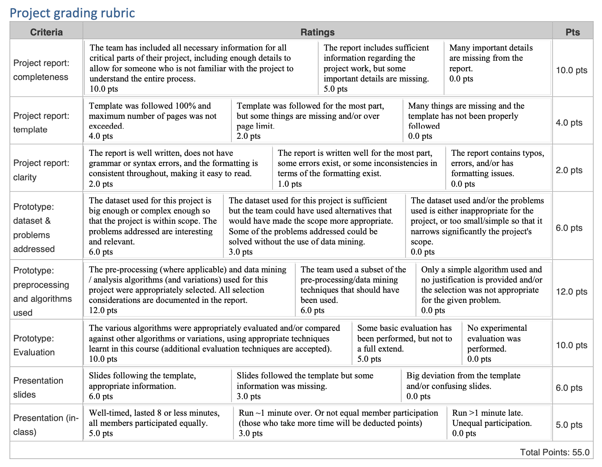

**CMPE 255 – Data Mining Spring 2023**

**Group Project**

Project Timeline 

- 4/13: Project proposal DUE 
  - Dataset selected 
  - Submit based on the instructions 
- 5/8: Project report & presentation slides due on Canvas (Date is FINAL) 
- 5/9, 5/11: Project presentations 
* This is a group project (groups of 4 students). However, each student will be graded individually (please refer to the syllabus for details). 
* A list of online resources is posted on Canvas. 
* All project documentation (project proposal, project report) should be submitted in the appropriate assignment in Canvas (one per team).  
* Provide  appropriate  citations  in  your  written  work,  including  for  datasets. Plagiarism will not be tolerated. 

Project proposal 

Should be 1-2 pages long and include:* 

- Student names 
- Team name (optional) 
- Project title 
- Project description 
- Proposed methodology/techniques/resources/datasets to be used (see details below) 
- It is important to secure an adequately large dataset before committing to an idea.  

General guidelines 

The project should be an application that executes an in-depth data mining analysis of a large dataset. You should integrate/combine one or more data mining techniques studied  in  this  course  (**Association  analysis,  Classification,  Regression, Clustering, Dimensionality reduction**) into a solution for a specific problem.  

- The project will be carried out by teams of 4 students. If you are unable to find a team or are missing a member, please use the discussion forum to search for teammates. 
- Project deliverables: 
- Final report containing: 
  - Github  link  to  implementation  (source  code,  binary,  and instructions on how to use the software) 
  - Description of problem and methods used 
  - experimental results (evaluation of algorithms, parameters etc.) 
- presentation slides 
- You may use publicly available (open source) code in your application and existing tools/platforms but this should be explicitly stated in your report. You can choose any programming language to implement your project. You are encouraged  to  use  Python  libraries  (SciPy,  NumPy,  Pandas,  NLTK,  Scrapy, Scikit-Learn), Spark’s MLib, Mahout on AWS, R libraries, or develop your own code. 

If you intend to use parts of a previous or existing project from other class (or your MS project), you need to talk to me in order to get approval (not guaranteed). 

Choosing a topic 

In this project, the team is responsible for proposing a topic to work on. Even though I am providing you with a list of suggestions, it is preferable (and more fun!) to pick a problem “closer to your heart”. Just make sure that data are available that you can use before writing the proposal (no data availability means that you will have to revise your proposal and waste valuable time).  

Therefore, it is highly recommended that you look at available data sets that look interesting (and are large enough) and then try to formulate a problem/application around them. Many links to datasets are posted on Canvas. However, you are free to explore other options and/or consider writing a script that will collect data from existing  sources  (again,  you  have  to  ensure  that  you’ll  be  able  to  do  this  before committing to a project). 

All the projects should include one or more (depending on the scope) data mining algorithms. However, an analysis of some data is not sufficient. Your analysis must be integrated in an application that has some purpose/use! 

A few sample projects are (these are provided mainly to give you an idea of the scope of the project): 

- Design a program that will classify review comments (on products, blogs, etc.) as spam/fake using sentiment analysis 
- Design a predictive model for sports events or sport-related activities (e.g. predict which team is going to win the super bowl). 
- Design a program that will use/analyze data from social networks. There are so many possible ways of doing this – e.g. analyze tweets in different US states and find the “happiest” folks, then show results on a map. 
- Use the data provided by a city (e.g. San Jose or San Francisco) and see what interesting patterns & applications you can implement that would be useful in a community. 
- Use data collected by smart devices (e.g. activity, geo-location, etc.) and design an application that helps the user in some way. 
- Analyze video data from intersections to detect patterns in the flow of traffic, analyze the categories of vehicles that travel on a given segment of a highway at different times of a day, or design a traffic signal control system that uses sensory  input  from  video  cameras  to  intelligently  and  dynamically  adjust traffic. 

Topics to avoid (many others have done these before): 

- Movie/Song/Book recommendation system 
- Sentiment analysis/Word clouds on Twitter 
- Anything using the WEKA GUI (too simple!) 

Data

Datasets used for this project must have enough complexity where analysis via non- data mining methods (e.g., using Excel) would not be possible. This can either mean there are a lot samples and many attributes (e.g., > 200,000 samples and > 25 features, i.e., > 5M non-zeros) or that the data is heterogeneous and complex (e.g., mixing text profiles with extracted attributes from multiple sources). 

Deliverables 

**Project Report**  

- Report **should not exceed 10 pages,** with font size at least 10(additional details if needed can be included in an Appendix. However, the data in the appendix will not contribute to/against your final grade and should be only informative.)**  
- A project report template has been included in the Appendix. You need to update/adjust the template to your project’s focus and details. 

**Presentation** 

Presentation slides should be uploaded to Canvas. All team members need to present some part of the talk. Depending on the type of the project, you can include a short demo of your prototype, but the demo counts as part of your presentation and no additional time will be allocated. Each team will have 10-15 minutes to present.  

**Code & Binary** 

You will need to create and maintain a public github repository of your project. Your project distribution files should contain the following: 

1. Complete source code (be sure that your source code is fully documented and easy to read), including data pre-processing scripts. 
1. Binary files (e.g., executables, DLLs, Class files) or other components necessary to run your program. 
1. Readme file containing instructions on how to compile, install, and/or run your program. 
1. A small sample of the test data that can be used for evaluation of your system, in addition to the full dataset you used in your “production” environment. 

Evaluation 

The  projects  will  be  evaluated  based  on  significance,  design,  correctness, documentation, and appropriate evaluation/testing.  A grading rubric for the project has been included in the Appendix. 

Each student will be evaluated individually. Your final grade will be calculated based on: 

- The overall quality of the project report 
- The overall quality of the project prototype (implementation) 
- The overall quality of the experimental evaluation of your approach 
- The individual presentation and overall quality of the presentation 
- The individual participation in all project aspects (as shown by the project timeline and the peer evaluation) 

APPENDIX  

Sample of previous CMPE 255 project topics 

Please note that this is for your reference, in order to understand the expected scope and extend of work. However, I will not approve projects that cover the exact same topics (combination of idea & dataset) as listed below. 

Project example #1: Fake news automatic detection 

The objective of this project is to build a classification model that will be able to detect fake news. It is possible to use various types of classifiers such as: regularized logistic regression classifiers, Support Vector Machine (SVM), Neural Networks(NN), and others. The dataset used contains 12.8K manually labeled short statements in various contexts from POLITIFACT.COM, which provides detailed analysis report and links to source documents for each case. 

Dataset link:[ https://www.cs.ucsb.edu/~william/data/liar_dataset.zip ](https://www.cs.ucsb.edu/~william/data/liar_dataset.zip)Project example #2: Clustering analysis of Bay Area restaurants 

This project looks at performing an exploratory analysis of the Bay Area restaurants through cluster analysis. The goal is to identify homogenous groups of restaurants the grouping of which is not obvious otherwise. The project uses data from the Yelp dataset, and can look at attributes such as: location, food/restaurant type, review stars, review count, restaurant name, and others. It is possible to employ clustering techniques such as hierarchical clustering, density-based clustering and others, in conjunction with other statistical analysis methods (e.g. discriminant analysis) to discover and interpret the clusters. 

Dataset link:[ https://www.yelp.com/dataset ](https://www.yelp.com/dataset)

Other project ideas: 

- Clustering analysis of Bay Area restaurants (dataset: Yelp) 
- Personalized news feed using Facebook data (datasets: Facebook and Yahoo! News) 
- SMS classification (dataset: SMS Spam from UCI repository) 
- Identification  of  spam/fraudulent  advertisements  on  craigslist  (dataset: craigslist) 
- Crime recognition and prediction system (dataset: SFPD crime incident database) 
- Forecasting elections using sentiment analysis on tweets (dataset: Twitter).  
- Polarity analysis of movie reviews (dataset: MovieLens) 
- Analysis of rent prices given external factors (such as nearby schools, jails, etc.) (the students used 3 different datasets to perform their analysis (scraped data from zillow.com, used yelp, and census data). 

Project report template Section 1 Introduction 

- Motivation 
- Objective 
- (Literature/Market review) 

Section 2 System Design & Implementation details 

- Algorithm(s) considered/selected (and why) 
- Technologies & Tools used (and why) 
- Architecture-related decisions (if applicable) 
- System (and subsystems if needed) design/architecture/data flow (you may use diagrams with some supportive text) 
- (Component details) 
- Use cases / GUI / screenshots (as applicable) 

Section 3 Experiments / Proof of concept evaluation 

- Dataset(s) used (name, source, type of data, size of data, # of instances/statistics, any preprocessing performed etc.) 
- Methodology followed (e.g. n-fold-cross validation, number of folds, size of training/test set etc.) (as applicable) 
- Graphs showing different parameters/algorithms evaluated in a comparative manner, along with some supportive text. (as applicable)  
- Analysis of results 

Section 4 Discussion & Conclusions (bullet points as applicable) 

- Decisions made 
- Difficulties faced 
- Things that worked 
- Things that didn’t work well 
- Conclusion 

Section 5 Project Plan / Task Distribution 

- Break into components and clearly explain  
- Who was assigned to what task 
- Who ended up doing what task (justify as applicable)

Project grading rubric 

